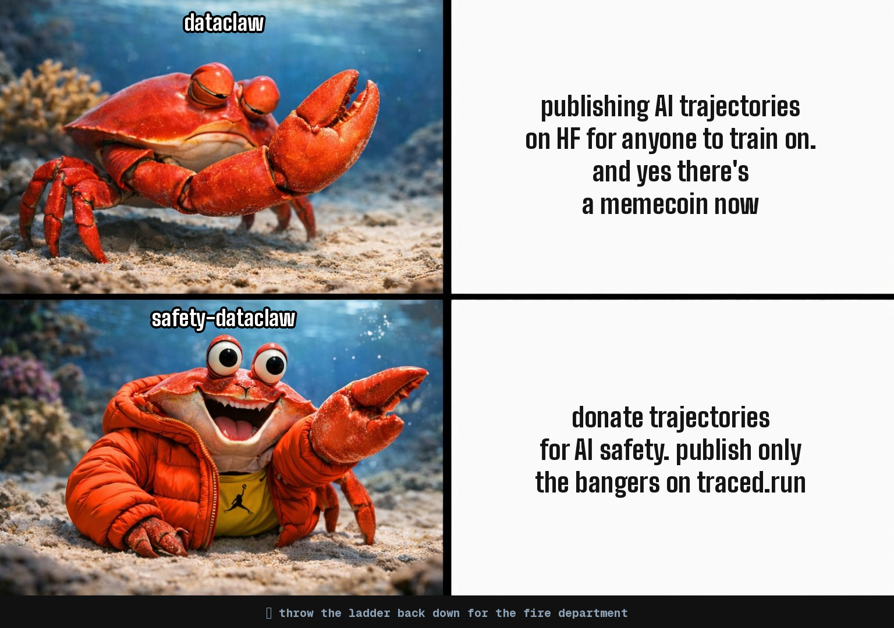

# Trace-Sanitizer

Don't put your AI trajectories on HF. Donate them for AI safety.

Trace-Sanitizer sanitizes AI agent trajectories for [traced.run](https://traced.run).
There you can see the trajectories that you donated, publish the interesting ones in the feed, and chat about them with the community.
Supporting: Claude Code, Codex, Gemini CLI, and OpenCode.

We need to differentially accelerate defensive technologies such as monitoring and alignment to prepare for a world with powerful AI.
Donating your trajectories with trace-sanitizer will actively support AI safety research.

Please reach out if you have any privacy concerns. Trace Sanitizer builds on DataClaw.

**Donating trajectories will be enabled shortly.** The CLI and traced.run are in active development — stay tuned.



**Core principle:** Safety-conscious users should never have to send unsanitized data off their machine. The CLI sanitizes locally; you upload the clean data yourself via the traced.run web interface.

## Give this to your coding agent

Paste this into Claude Code, Codex, or any coding agent:

```
Help me export my Claude Code, Codex, Gemini CLI, and OpenCode conversation history using trace-sanitizer.
Install it, set up the skill, then walk me through the process.

STEP 1 — INSTALL
  pip install trace-sanitizer
  If that fails: git clone https://github.com/JoachimSchaeffer/trace-sanitizer.git /tmp/trace-sanitizer && pip install /tmp/trace-sanitizer
  If that also fails, ask the user where the source is.

STEP 2 — INSTALL SKILL
  trace-sanitizer update-skill claude

STEP 3 — START
  trace-sanitizer prep
  Every trace-sanitizer command outputs next_steps in its JSON — follow them through the entire flow.

STEP 3A — CHOOSE SOURCE SCOPE (REQUIRED BEFORE EXPORT)
  Ask the user explicitly: Claude Code, Codex, Gemini CLI, OpenCode, or all?
  trace-sanitizer config --source "claude|codex|gemini|opencode|all"
  Do not export until source scope is explicitly confirmed.

STEP 3B — PRESENT ALL FOLDERS (REQUIRED BEFORE EXPORT)
  trace-sanitizer list --source "claude|codex|gemini|opencode|all"
  Send the FULL project/folder list to the user in a message (name, source, sessions, size, excluded).
  Ask which projects to exclude.
  trace-sanitizer config --exclude "project1,project2" OR trace-sanitizer config --confirm-projects
  Do not export until folder selection is explicitly confirmed.

STEP 3C — CHOOSE TOOL OUTPUT INCLUSION (REQUIRED BEFORE EXPORT)
  Ask the user: should tool outputs (file contents, bash stdout, grep results) be included?
  Including them provides richer trajectory data but increases export size significantly.
  Secrets are still redacted either way.
  trace-sanitizer config --include-tool-outputs OR trace-sanitizer config --no-tool-outputs

STEP 4 — EXPORT + REVIEW + CONFIRM
  trace-sanitizer export --output /tmp/trace_sanitizer_export.jsonl
  Review PII findings and apply excludes/redactions as needed.
  Full name is requested for an exact-name privacy scan against the export.
  If the user declines sharing full name, use --skip-full-name-scan and attest the skip reason.
  trace-sanitizer confirm --full-name "THEIR FULL NAME" --attest-full-name "..." --attest-sensitive "..." --attest-manual-scan "..."

STEP 5 — UPLOAD VIA WEB
  Upload the exported JSONL file at https://traced.run
  After upload, visit https://traced.run to publish individual trajectories.

IF ANY COMMAND FAILS DUE TO A SKIPPED STEP:
  Restate the checklist above and resume from the blocked step (do not skip ahead).

IMPORTANT: Always review exported data for PII before uploading.
```

<details>
<summary><b>Manual usage (without an agent)</b></summary>

### Quick start

```bash
pip install trace-sanitizer

# See your projects
trace-sanitizer prep
trace-sanitizer config --source all  # REQUIRED: choose claude, codex, gemini, opencode, or all
trace-sanitizer list --source all    # Present full list and confirm folder scope before export

# Configure
trace-sanitizer config --exclude "personal-stuff,scratch"
trace-sanitizer config --redact-usernames "my_github_handle,my_discord_name"
trace-sanitizer config --redact "my-domain.com,my-secret-project"

# Export locally
trace-sanitizer export

# Review and confirm
trace-sanitizer confirm \
  --full-name "YOUR FULL NAME" \
  --attest-full-name "Asked for full name and scanned export for YOUR FULL NAME." \
  --attest-sensitive "Asked about company/client/internal names and private URLs; none found or redactions updated." \
  --attest-manual-scan "Manually scanned 20 sessions across beginning/middle/end and reviewed findings."

# Optional if user declines sharing full name
trace-sanitizer confirm \
  --skip-full-name-scan \
  --attest-full-name "User declined to share full name; skipped exact-name scan." \
  --attest-sensitive "Asked about company/client/internal names and private URLs; none found or redactions updated." \
  --attest-manual-scan "Manually scanned 20 sessions across beginning/middle/end and reviewed findings."

# Upload via web
# Upload the exported JSONL file at https://traced.run
```

### Commands

| Command | Description |
|---------|-------------|
| `trace-sanitizer status` | Show current stage and next steps (JSON) |
| `trace-sanitizer prep` | Discover projects, output JSON |
| `trace-sanitizer prep --source all` | Prep with all sources explicitly selected |
| `trace-sanitizer prep --source claude` | Prep using only Claude Code sessions |
| `trace-sanitizer prep --source codex` | Prep using only Codex sessions |
| `trace-sanitizer prep --source gemini` | Prep using only Gemini CLI sessions |
| `trace-sanitizer prep --source opencode` | Prep using only OpenCode sessions |
| `trace-sanitizer list` | List all projects with exclusion status |
| `trace-sanitizer list --source all` | List all sources |
| `trace-sanitizer list --source codex` | List only Codex projects |
| `trace-sanitizer config` | Show current config |
| `trace-sanitizer config --source all` | REQUIRED source scope selection (`claude`, `codex`, `gemini`, `opencode`, or `all`) |
| `trace-sanitizer config --exclude "a,b"` | Add excluded projects (appends) |
| `trace-sanitizer config --redact "str1,str2"` | Add strings to always redact (appends) |
| `trace-sanitizer config --redact-usernames "u1,u2"` | Add usernames to anonymize (appends) |
| `trace-sanitizer config --confirm-projects` | Mark project selection as confirmed |
| `trace-sanitizer export` | Export sessions to JSONL |
| `trace-sanitizer export --source all` | Export all sources |
| `trace-sanitizer export --all-projects` | Include everything (ignore exclusions) |
| `trace-sanitizer export --no-thinking` | Exclude extended thinking blocks |
| `trace-sanitizer export --include-tool-outputs` | Include tool results (file contents, bash stdout, etc.) |
| `trace-sanitizer confirm --full-name "NAME" ...` | Scan for PII, run exact-name privacy check, verify review attestations, confirm export |
| `trace-sanitizer update-skill claude` | Install/update the trace-sanitizer skill for Claude Code |

</details>

<details>
<summary><b>What gets exported</b></summary>

| Data | Included | Notes |
|------|----------|-------|
| User messages | Yes | Full text (including voice transcripts) |
| Assistant responses | Yes | Full text output |
| Extended thinking | Yes | Claude's reasoning (opt out with `--no-thinking`) |
| Tool calls | Yes | Tool name + summarized input |
| Tool results | Optional | Opt in with `--include-tool-outputs` (secrets redacted) |
| Token usage | Yes | Input/output tokens per session |
| Model & metadata | Yes | Model name, git branch, timestamps |

### Privacy & Redaction

Trace-Sanitizer applies multiple layers of protection:

1. **Path anonymization** — File paths stripped to project-relative
2. **Username hashing** — Your macOS username + any configured usernames replaced with stable hashes
3. **Secret detection** — Regex patterns catch JWT tokens, API keys (Anthropic, OpenAI, HF, GitHub, AWS, etc.), database passwords, private keys, Discord webhooks, and more
4. **Entropy analysis** — Long high-entropy strings in quotes are flagged as potential secrets
5. **Email redaction** — Personal email addresses removed
6. **Custom redaction** — You can configure additional strings and usernames to redact
7. **Tool input pre-redaction** — Secrets in tool inputs are redacted BEFORE truncation to prevent partial leaks

**This is NOT foolproof.** Always review your exported data before uploading.
Automated redaction cannot catch everything — especially service-specific
identifiers, third-party PII, or secrets in unusual formats.

To help improve redaction, report issues: https://github.com/JoachimSchaeffer/trace-sanitizer/issues

</details>

<details>
<summary><b>Data schema</b></summary>

Each line in the JSONL export is one session:

```json
{
  "session_id": "abc-123",
  "project": "my-project",
  "model": "claude-opus-4-6",
  "git_branch": "main",
  "start_time": "2025-06-15T10:00:00+00:00",
  "end_time": "2025-06-15T10:30:00+00:00",
  "messages": [
    {"role": "user", "content": "Fix the login bug", "timestamp": "..."},
    {
      "role": "assistant",
      "content": "I'll investigate the login flow.",
      "thinking": "The user wants me to look at...",
      "tool_uses": [{"tool": "Read", "input": "src/auth.py", "output": "(only with --include-tool-outputs)"}],
      "timestamp": "..."
    }
  ],
  "stats": {
    "user_messages": 5, "assistant_messages": 8,
    "tool_uses": 20, "input_tokens": 50000, "output_tokens": 3000
  }
}
```

</details>

## License

MIT — forked from [dataclaw](https://github.com/peteromallet/dataclaw) by Banodoco.
